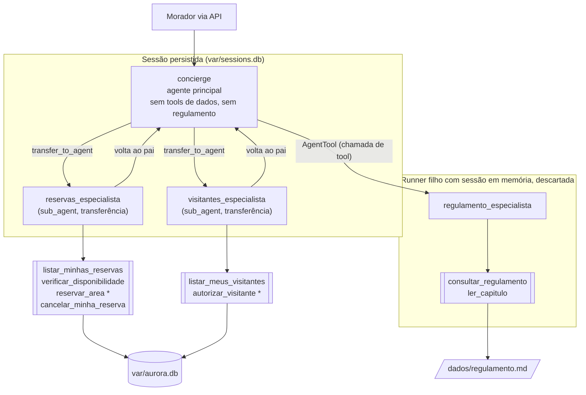

# Residencial Aurora — assistente virtual com Google ADK

Assistente do aplicativo dos moradores do Residencial Aurora, construído com **Google ADK 2.9.1** e exposto por uma API **FastAPI** em `http://localhost:8000`. Pelo chat, o morador reserva e cancela áreas comuns, autoriza visitantes e tira dúvidas sobre o regulamento.

> Princípio de projeto: **o modelo decide o caminho, o código decide o que é permitido.** Toda regra crítica é imposta por código determinístico (tools, `require_confirmation`, state da sessão, índice único do banco, validação na API). O prompt só orienta; ele nunca é a última linha de defesa.

## Arquitetura



`*` = tool com confirmação imposta pelo ADK (`require_confirmation`).

| Agente | Arquivo | Responsabilidade | Como é acionado | Por quê |
|---|---|---|---|---|
| `concierge` | `src/aurora/agents/concierge.py` | Conversa com o morador, entende a intenção e distribui o trabalho. Não tem tools de leitura ou escrita de dados e não recebe o regulamento. | `root_agent` do `App` | Único ponto de contato. Com o contexto enxuto, cada chamada fica mais barata. |
| `reservas_especialista` | `src/aurora/agents/reservas.py` | Lista, verifica disponibilidade, reserva e cancela reservas do apartamento da sessão. | `sub_agents` do concierge (**transferência**) | `reservar_area` pede confirmação. O pedido de confirmação (`adk_request_confirmation`) precisa ficar na **sessão principal persistida**: é dali que a API o lê para `confirmacoes_pendentes`, e é por ele que o Runner retoma **este** agente depois da aprovação, inclusive após reiniciar a API. Dentro de um `AgentTool`, a confirmação ficaria presa numa sessão filha em memória e se perderia. |
| `visitantes_especialista` | `src/aurora/agents/visitantes.py` | Lista e autoriza visitantes do apartamento da sessão. | `sub_agents` do concierge (**transferência**) | Pelo mesmo motivo: `autorizar_visitante` sempre pede confirmação. |
| `regulamento_especialista` | `src/aurora/agents/regulamento.py` | Responde dúvidas com base só no capítulo relevante do regulamento. | `AgentTool` na lista de `tools` do concierge | O `AgentTool` roda o especialista num `Runner` próprio com `InMemorySessionService`. O capítulo lido pela tool fica nesse contexto isolado e descartado, e à sessão principal chega só a resposta curta (Garantia 4). Ele não grava dados, então não precisa de confirmação nem de persistência. |

Configuração de transferência: os especialistas voltam ao concierge quando o assunto muda, mas não transferem direto um para o outro (`disallow_transfer_to_parent=False`, `disallow_transfer_to_peers=True`). Como o Runner mantém a conversa com o último agente que respondeu (e que pode transferir de volta ao pai), uma nova mensagem sobre o mesmo assunto cai direto no especialista ativo. Com `ResumabilityConfig(is_resumable=True)`, a resposta de uma confirmação é entregue ao autor da chamada de tool, que é o especialista, e não ao concierge.

**Runtime** (`src/aurora/runtime.py`): um único `App` com `ResumabilityConfig(is_resumable=True)`, um `Runner` e um `DatabaseSessionService` sobre SQLite (`sqlite+aiosqlite`). `APP_NAME` e `USER_ID` são constantes (`src/aurora/config.py`), e o apartamento vive no state da sessão.

**Armazenamento**: dois arquivos SQLite em `var/` (fora do Git), sem serviço externo.

- `var/aurora.db` guarda o domínio: `apartamentos`, `areas`, `reservas`, `visitantes` e `codigos_emitidos`. O único acesso é `src/aurora/domain/repositorio.py`.
- `var/sessions.db` guarda as sessões e os eventos do ADK.

Os arquivos de `dados/` são só lidos: servem de semente do banco e de fonte do regulamento.

**Modelos**: Gemini via Google AI Studio, configuráveis no `.env`. Todos usam retry com backoff exponencial para `429`/`5xx` (`src/aurora/agents/modelos.py`).

**Estrutura**

```
src/aurora/
├── config.py              # .env, caminhos, APP_NAME/USER_ID, modelos
├── main.py                # FastAPI + comando aurora-api
├── runtime.py             # DatabaseSessionService, App (resumable), Runner
├── api/
│   ├── routes_sessoes.py  # /sessoes, /mensagens, /confirmacoes, /eventos
│   ├── routes_verificacao.py
│   ├── confirmacoes.py    # pendências derivadas dos eventos persistidos
│   └── schemas.py
├── agents/                # concierge + 3 especialistas
├── tools/                 # contexto.py, reservas_tools.py, visitantes_tools.py, regulamento_tools.py
├── domain/repositorio.py  # única porta de leitura/escrita do domínio
└── infra/                 # db.py (DDL, WAL, busy_timeout), seed.py (aurora-reset)
```

## Garantias

### 1. Cobrança ou acesso só com confirmação

| Onde | Trecho |
|---|---|
| `src/aurora/tools/reservas_tools.py` | `_precisa_confirmar_reserva` e `reservar_area_tool = FunctionTool(reservar_area, require_confirmation=_precisa_confirmar_reserva)`: pede confirmação quando a área tem taxa > 0 e a data está livre. A quadra (taxa 0) não pede. |
| `src/aurora/tools/reservas_tools.py` | `reservar_area`: trava final. Reserva com taxa só é gravada com `confirmacao_aprovada(tool_context)`. |
| `src/aurora/tools/visitantes_tools.py` | `autorizar_visitante_tool = FunctionTool(autorizar_visitante, require_confirmation=True)`, e a própria `autorizar_visitante` também exige `confirmacao_aprovada`. |
| `src/aurora/tools/contexto.py` | `confirmacao_aprovada`: só é verdadeira com uma `ToolConfirmation(confirmed=True)` entregue pelo ADK. `traduzir_recusa` (`after_tool_callback` dos especialistas) troca o `"This tool call is rejected."` do ADK por uma resposta que diz ao modelo que o morador negou, para ele não confundir recusa com data indisponível. |
| `src/aurora/api/confirmacoes.py` | `listar_pendentes`: uma pendência é uma `FunctionCall adk_request_confirmation` sem `FunctionResponse` de mesmo `id` nos eventos persistidos. `detalhes` traz área, data e taxa (reserva) ou nome e data (visitante). |
| `src/aurora/api/routes_sessoes.py` | `responder_confirmacao`: devolve **409** se o `id` não está em `listar_pendentes(session)` e nesse caso não chama o Runner. Se estiver pendente, monta `FunctionResponse(name="adk_request_confirmation", response={"confirmed": ...})` e retoma a execução. |
| `src/aurora/domain/repositorio.py` | `_criar_reserva_sync` / `_autorizar_visitante_sync`: `origem_call` (UNIQUE) = `function_call_id`. Se a retomada reexecutar a tool, nada é gravado em dobro. |

Por que não depende do modelo:

- A decisão de pedir confirmação é código (`require_confirmation`) e roda antes da função da tool. Sem aprovação, o ADK nem chama a função. Mesmo que chamasse, a função recusa sem `confirmacao_aprovada`.
- A aprovação só existe como `FunctionResponse` de `adk_request_confirmation`, e o único lugar do sistema que a cria é a rota `/confirmacoes`. O texto do morador ("já estou confirmando aqui") entra em `/mensagens` sempre como `Part(text=...)`, nunca como `FunctionResponse`.
- As pendências são derivadas dos eventos da sessão. Depois de respondida, a confirmação tem uma `FunctionResponse` e deixa de estar pendente. Por isso reenviar o mesmo `id`, mandar um `id` inventado ou um de outra sessão dá **409**.
- Negar: o ADK devolve `"This tool call is rejected."` ao modelo sem executar a função, e nada é gravado.

### 2. Cada sessão pertence a um apartamento

| Onde | Trecho |
|---|---|
| `src/aurora/api/routes_sessoes.py` | `criar_sessao`: `session_service.create_session(..., state={CHAVE_APTO: apartamento})`. É o **único** ponto em que o apartamento entra na sessão. |
| `src/aurora/tools/contexto.py` | `apartamento_da_sessao(tool_context)`: lê `tool_context.state["apartamento"]`. Toda tool de reservas e visitantes chama essa função. |
| `src/aurora/tools/reservas_tools.py`, `src/aurora/tools/visitantes_tools.py` | Nenhuma tool tem parâmetro `apartamento`. |
| `src/aurora/domain/repositorio.py` | `listar_reservas`, `_cancelar_reserva_sync`, `listar_visitantes`: filtram por `apartamento = ?`. `data_ocupada` devolve só `bool`. |
| `src/aurora/tools/reservas_tools.py` | `cancelar_minha_reserva`: responde `nao_encontrada` do mesmo jeito para "não existe" e "é de outro apartamento". `reservar_area` e `verificar_disponibilidade` dizem só se a data está livre, nunca de quem é. |

Por que não depende do modelo:

- O modelo não tem como escolher um apartamento, porque nenhuma tool aceita um. O valor vem do state, gravado pela API na criação da sessão.
- Nenhuma tool escreve no state, e mensagens do morador não alteram o state.
- Os retornos das tools nunca contêm código, dono ou visitantes de outro apartamento. Por isso `RSV-4821`, `Marina Duarte` ou o número `302` não têm como chegar à conversa nem aos eventos por uma tool.
- As instruções dos agentes não contêm o número do apartamento, então não há o que "trocar" nem "vazar".

### 3. Nada se perde no reinício

| Onde | Trecho |
|---|---|
| `src/aurora/runtime.py` | `criar_session_service`: `DatabaseSessionService(db_url="sqlite+aiosqlite:///var/sessions.db")`, com WAL e `busy_timeout`. |
| `src/aurora/runtime.py` | `App(..., resumability_config=ResumabilityConfig(is_resumable=True))`: a aprovação é entregue ao especialista que pediu a confirmação, também depois de reiniciar a API. |
| `src/aurora/config.py` | `APP_NAME` e `USER_ID` constantes, para `get_session` encontrar as mesmas sessões depois do reinício. |
| `src/aurora/infra/seed.py` | `semear_se_vazio` (chamada no `lifespan` de `src/aurora/main.py`): cria o schema e só semeia um banco **novo**. Subir a API nunca restaura dados. |
| `src/aurora/api/confirmacoes.py` | `listar_pendentes`: não há estado em memória. As pendências vêm dos eventos persistidos. |

Por que não depende do modelo: tudo o que importa (eventos, state, reservas, visitantes, códigos emitidos) está em SQLite. Reiniciar o processo não apaga nada, e o Runner reconstrói a partir dos eventos persistidos quem deve continuar a conversa.

### 4. O regulamento é consultado, não carregado

| Onde | Trecho |
|---|---|
| `src/aurora/tools/regulamento_tools.py` | `consultar_regulamento(tema)`: divide `dados/regulamento.md` pelos cabeçalhos `## Capítulo` e devolve **um único capítulo**, escolhido por pontuação determinística de palavras-chave (`_pontuar`, `_SINONIMOS`). `ler_capitulo(numeral)` também devolve um só capítulo. Nenhuma tool devolve o arquivo inteiro. |
| `src/aurora/agents/concierge.py` | `tools=[AgentTool(agent=regulamento_especialista)]`: o especialista roda num Runner filho com `InMemorySessionService`, e o texto do capítulo nunca entra na sessão principal. Na sessão ficam só a `FunctionCall regulamento_especialista({"request": ...})` e a resposta curta. |
| `src/aurora/agents/concierge.py` | `INSTRUCAO` do concierge: não contém o regulamento nem um resumo dele. O arquivo só é lido em `regulamento_tools.py`. |
| `src/aurora/agents/regulamento.py` | Instrução: responder em no máximo três frases, citando o artigo, sem transcrever o capítulo. |

Por que não depende do modelo: o especialista só enxerga o capítulo que a tool escolheu, e isso acontece numa sessão descartada. Mesmo que ele resolvesse "colar tudo", não teria outros capítulos para colar, e o texto bruto não é persistido.

### 5. Dois moradores, uma reserva

| Onde | Trecho |
|---|---|
| `src/aurora/infra/db.py` | `CREATE UNIQUE INDEX ux_reserva_ativa_area_data ON reservas(area, data) WHERE status = 'ativa'` |
| `src/aurora/domain/repositorio.py` | `_criar_reserva_sync`: `BEGIN IMMEDIATE`, depois `INSERT`, **sem conferir a agenda antes**. `IntegrityError` no índice vira `ResultadoReserva("indisponivel")`. |
| `src/aurora/domain/repositorio.py` | `criar_reserva`: `asyncio.to_thread`, para não bloquear o event loop. As duas aprovações rodam de fato em paralelo. |
| `src/aurora/api/routes_sessoes.py` | `_locks`: um `asyncio.Lock` **por sessão**, nunca global. |

Por que não depende do modelo nem de "checar antes": a exclusividade é avaliada pelo SQLite no instante do `INSERT`, e duas transações não conseguem satisfazer o índice ao mesmo tempo. `BEGIN IMMEDIATE` com `busy_timeout` faz o segundo escritor **esperar** em vez de falhar com `database is locked`. O perdedor recebe `status: indisponivel`, o especialista responde normalmente e a API devolve **200**. Cancelar é `UPDATE status='cancelada'`: a linha nunca é apagada, então a data fica livre de novo, mas o código continua ocupado.

**Regra 5 (códigos únicos)**: `_novo_codigo` gera `RSV-XXXXXXXX` aleatório e o grava em `codigos_emitidos` (PK) na mesma transação da reserva. Essa tabela nunca é limpa, nem pela restauração, então nenhum código se repete, nem o de uma reserva cancelada.

## Como rodar

**Pré-requisitos**

- Python 3.12+ e [uv](https://docs.astral.sh/uv/)
- Uma chave do [Google AI Studio](https://aistudio.google.com/apikey)
- Nenhum serviço externo: o armazenamento é SQLite local, em `var/`

**Variáveis do `.env`**

```bash
cp .env.example .env   # e preencha GOOGLE_API_KEY
```

| Variável | Obrigatória | Padrão | Descrição |
|---|---|---|---|
| `GOOGLE_API_KEY` | sim | — | Chave do Google AI Studio |
| `GOOGLE_GENAI_USE_VERTEXAI` | não | `FALSE` | Mantém o uso do AI Studio |
| `AURORA_MODELO_PRINCIPAL` | não | `gemini-2.5-flash` | Modelo do concierge |
| `AURORA_MODELO_ESPECIALISTAS` | não | `gemini-2.5-flash` | Modelo dos especialistas |
| `AURORA_DB_PATH` | não | `var/aurora.db` | Banco do domínio |
| `AURORA_SESSIONS_DB_PATH` | não | `var/sessions.db` | Banco das sessões do ADK |

**Comandos**

```bash
uv sync                         # instala (google-adk==2.9.1 fixado no pyproject.toml)
uv run aurora-reset             # restaura reservas e visitantes ao estado de dados/*.json
uv run aurora-api               # sobe a API em http://localhost:8000 (Ctrl+C para parar)
uv run adk web src/aurora/agents   # opcional: depuração visual (app "agents"; crie a sessão com state {"apartamento": "101"})
```

- `uv run aurora-reset` volta reservas e visitantes ao estado dos arquivos de `dados/` e **preserva as sessões**. Para também apagar todas as sessões, use `uv run aurora-reset --sessoes` com a API parada.
- `uv run aurora-api` não restaura nada: na primeira subida cria e semeia o banco, e nas seguintes só continua de onde parou.

**Exemplo rápido**

```bash
S=$(curl -s -XPOST localhost:8000/sessoes -H 'content-type: application/json' \
      -d '{"apartamento":"101"}' | jq -r .session_id)
curl -s -XPOST localhost:8000/sessoes/$S/mensagens -H 'content-type: application/json' \
      -d '{"texto":"Reserve o salão de festas para 2030-04-20."}'
# -> confirmacoes_pendentes: [{"id": "...", "acao": "reservar_area", "detalhes": {...}}]
curl -s -XPOST localhost:8000/sessoes/$S/confirmacoes -H 'content-type: application/json' \
      -d '{"id":"<id>","confirmado":true}'
curl -s localhost:8000/apartamentos/101/reservas
```

**Contrato da API**

| Rota | Resposta |
|---|---|
| `POST /sessoes` `{"apartamento"}` | `201 {"session_id"}` |
| `POST /sessoes/{id}/mensagens` `{"texto"}` | `200 {"resposta", "confirmacoes_pendentes": [{"id", "acao", "detalhes"}]}` |
| `POST /sessoes/{id}/confirmacoes` `{"id", "confirmado"}` | `200` (mesmo formato) ou `409` se o `id` não está pendente nesta sessão |
| `GET /sessoes/{id}/eventos` | `200` com todos os eventos da sessão, em ordem |
| `GET /apartamentos/{n}/reservas` | `200 [{"codigo", "area", "data"}]` (reservas ativas) |
| `GET /apartamentos/{n}/visitantes` | `200 [{"nome", "data"}]` |

Rotas com `{id}` de sessão inexistente respondem `404`.
